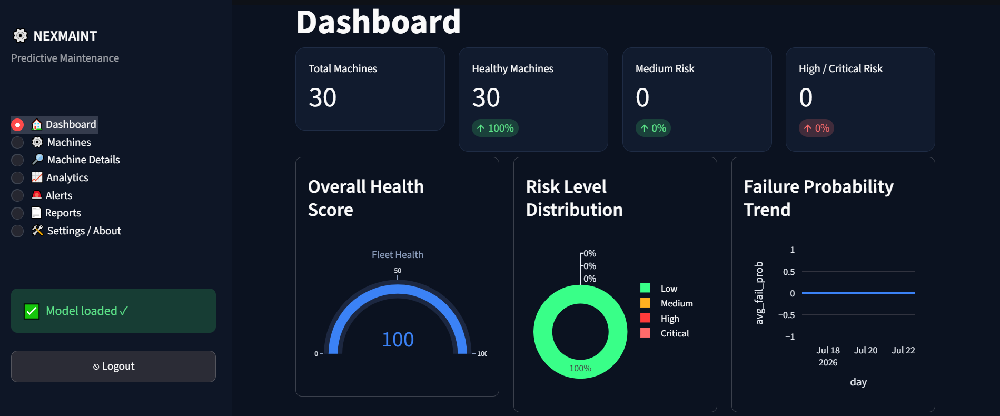
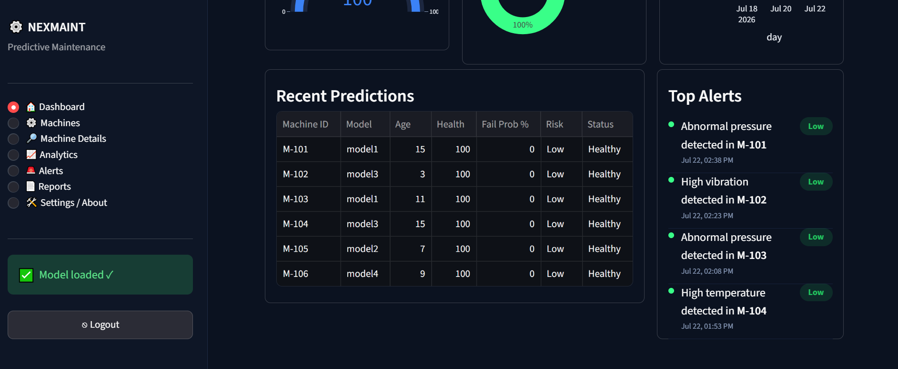
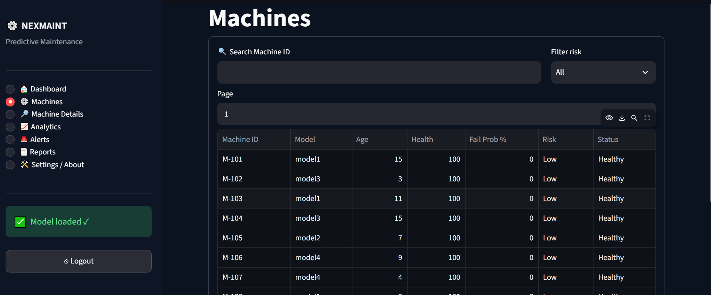
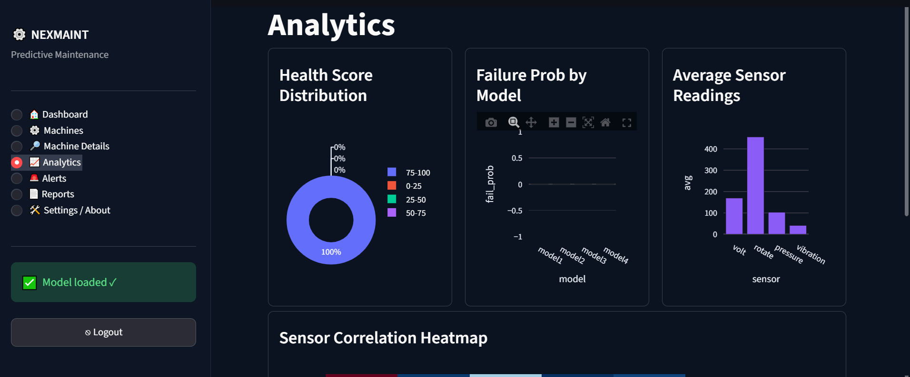
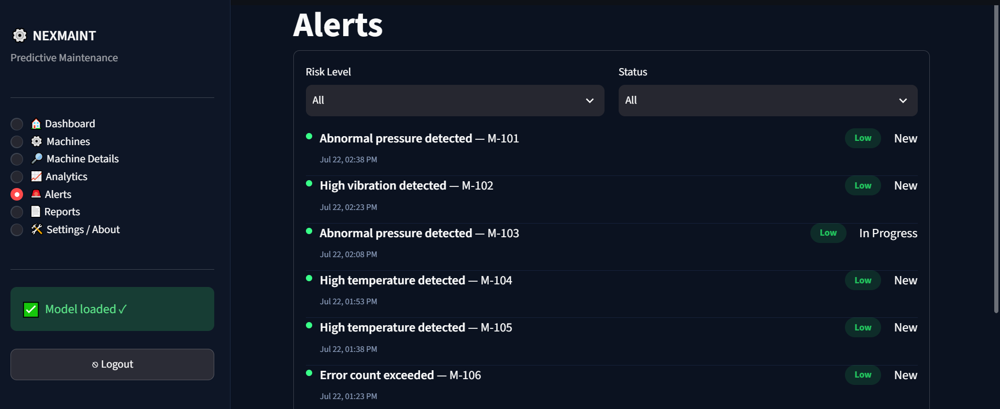
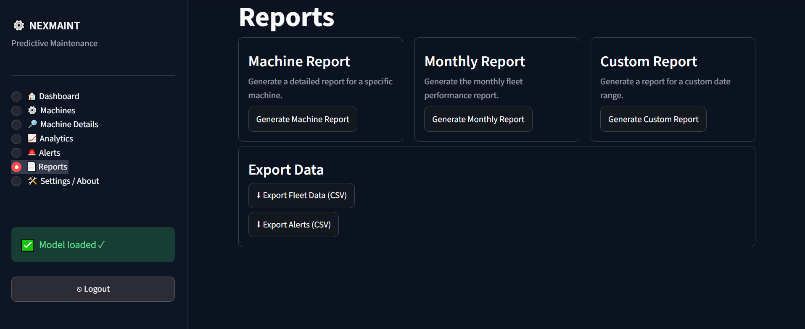

# 🚀 NEXMAINT - Predictive Maintenance System

NEXMAINT is an AI-powered Predictive Maintenance System that uses Machine Learning to predict industrial machine failures before they occur. The project helps industries reduce downtime, improve equipment reliability, and optimize maintenance schedules through intelligent failure prediction.

---

## 📌 Project Overview

This project uses the Microsoft Azure Predictive Maintenance dataset to train a Random Forest Classifier that predicts whether a machine is likely to fail based on sensor readings and machine information. The trained model is integrated into an interactive Streamlit dashboard for real-time predictions and visualization.

---

## ✨ Features

- Machine failure prediction using Machine Learning
- Interactive Streamlit dashboard
- Real-time failure probability prediction
- Machine health score visualization
- Risk level classification (Low, Medium, High, Critical)
- Analytics dashboard with charts
- Machine details and sensor monitoring
- Alerts and maintenance recommendations
- Report generation and CSV export

---

## 🛠️ Technologies Used

- Python
- Streamlit
- Scikit-learn
- Pandas
- NumPy
- Plotly
- Matplotlib
- Seaborn
- Joblib

---

## 🤖 Machine Learning Model

- Algorithm: Random Forest Classifier
- Dataset: Microsoft Azure Predictive Maintenance Dataset
- Feature Engineering:
  - Age Group
  - Rolling Average Vibration
  - Error Count
- Data Preprocessing:
  - One-Hot Encoding
  - Standard Scaling
  - Column Transformer

---

## 📊 Dataset

This project uses the **Microsoft Azure Predictive Maintenance Dataset**.

The dataset contains:

- Telemetry data
- Machine information
- Error logs
- Maintenance records
- Failure records

**Note:**  
The dataset is **not included** in this repository because it exceeds GitHub's 100 MB file size limit.

You can download it from Kaggle:

https://www.kaggle.com/datasets/arnabbiswas1/microsoft-azure-predictive-maintenance

After downloading, place the processed dataset (`master_cleaned.csv`) inside the `Data/` folder before running the project.

---

## 📁 Project Structure

```
NEXMAINT-Predictive-Maintenance/
│── app.py
│── PROJECT.ipynb
│── random_forest_model.pkl
│── preprocessor.pkl
│── requirements.txt
│── README.md
```

---
---

# 📸 Project Screenshots

## 🏠 Dashboard

### Dashboard 1


### Dashboard 2


---

## 🖥️ Machines

### Machines Overview


---

## 🤖 AI Prediction

### Machine Details - AI Prediction


---

## 📊 Machine Overview

### Machine Overview


---

## 📡 Sensor Monitoring

### Sensor Details


---

## 🛠️ Maintenance History

### Maintenance Records


### History


---

## 📈 Analytics

### Analytics Dashboard


---

## 🚨 Alerts

### Alerts Panel


---

## 📑 Reports

### Reports


---

## ⚙️ Settings & About

### Settings and About


---

## ▶️ How to Run

1. Clone the repository

```bash
git clone https://github.com/Gaganpreetkaur01/NEXMAINT-Predictive-Maintenance.git
```

2. Install dependencies

```bash
pip install -r requirements.txt
```

3. Run the application

```bash
streamlit run app.py
```

---

## 🎯 Future Improvements

- Real-time IoT sensor integration
- Cloud deployment
- Email alert system
- Explainable AI (SHAP)
- Predictive maintenance scheduling

---

## 👩‍💻 Developer

**Gaganpreet Kaur**

B.Tech Computer Science Engineering

Guru Nanak Dev University Regional Campus, Gurdaspur

---
